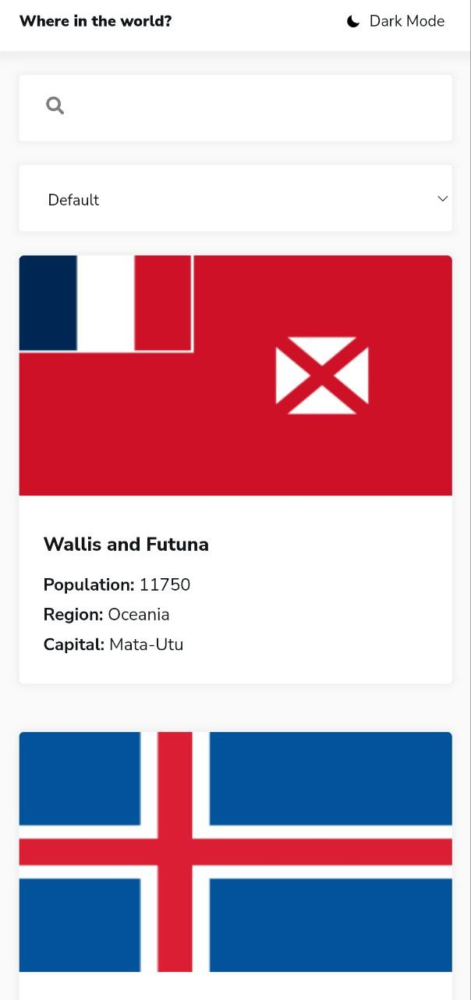
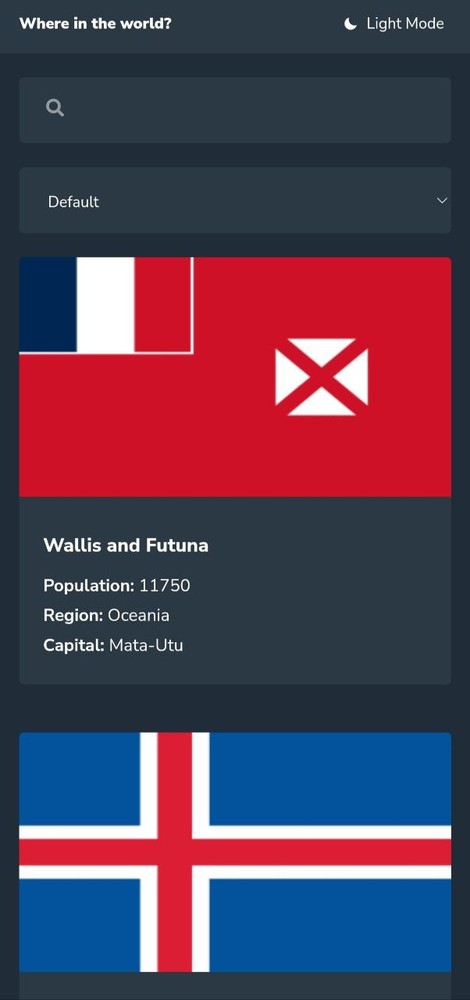

# Frontend Mentor - REST Countries API with color theme switcher solution

This is a solution to the [REST Countries API with color theme switcher challenge on Frontend Mentor](https://www.frontendmentor.io/challenges/rest-countries-api-with-color-theme-switcher-5cacc469fec04111f7b848ca). Frontend Mentor challenges help you improve your coding skills by building realistic projects.

## Table of contents

- [Overview](#overview)
  - [The challenge](#the-challenge)
  - [Screenshot](#screenshot)
  - [Links](#links)
- [My process](#my-process)
  - [Built with](#built-with)
  - [What I learned](#what-i-learned)
  - [Continued development](#continued-development)
- [Author](#author)
- [Acknowledgments](#acknowledgments)

## Overview

### The challenge

Users should be able to:

- See all countries from the API on the homepage
- Search for a country using an `input` field
- Filter countries by region
- Click on a country to see more detailed information on a separate page
- Click through to the border countries on the detail page
- Toggle the color scheme between light and dark mode *(optional)*

### Screenshot

 

 

### Links

- Solution URL: [Add solution URL here](https://github.com/MineGame01/REST-Countries-API)
- Live Site URL: [Add live site URL here](https://minegame01.github.io/REST-Countries-API)

## My process

### Built with

- Semantic HTML5 markup
- CSS custom properties
- Flexbox
- CSS Grid
- Mobile-first workflow
- [React](https://reactjs.org/) - JS library
- [React-Router](https://reactrouter.com/) - Navigation
- [React-Icons](https://react-icons.github.io/react-icons/) - Icons
- [Redux Toolkit](https://redux-toolkit.js.org/) - Library for React
- [Styled Components](https://styled-components.com/) - For styles
- [Axios](https://axios-http.com/) - Library for HTTP requests

### What I learned

I’m doing this project for the second time, the first time I tried to create styling using the Bootstrap library, but I couldn’t create a theme switch with it (I wanted to do it, but I didn’t know), then I rewrote all the styling in the Material UI framework, but It was difficult for me to style the basic components and I never did. And after all that, I decided to start writing the project a second time from scratch using the Styled Components library, and I managed to create components that can be used several times and also managed to create theme switching and saving to LocalStorage.

#### And in this project I learned.

- Learned the Styled Components library.
- Learned how to switch theme.
- Gained experience in code optimization.
- I learned a little how to work with LocalStorage.
- I learned a lot by reading the documentation about the libraries that were used to create the project.
- And much more!

### Continued development

#### Error window
I added something new to this project, this is an error window for http requests, and I want to further improve this development and use it in future projects.

#### Improvement
I also plan to continue improving this project by adding new features and improving the quality of the code.

## Author

- Website - [IMineGame](https://github.com/MineGame01)
- Frontend Mentor - [@MineGame01](https://www.frontendmentor.io/profile/MineGame01)
- Twitter - [@IMineGame](https://x.com/IMineGame)

## Acknowledgments

I thank Frontend Mentor for such cool projects that can teach you how to create new concepts and also learn new libraries and technologies!
